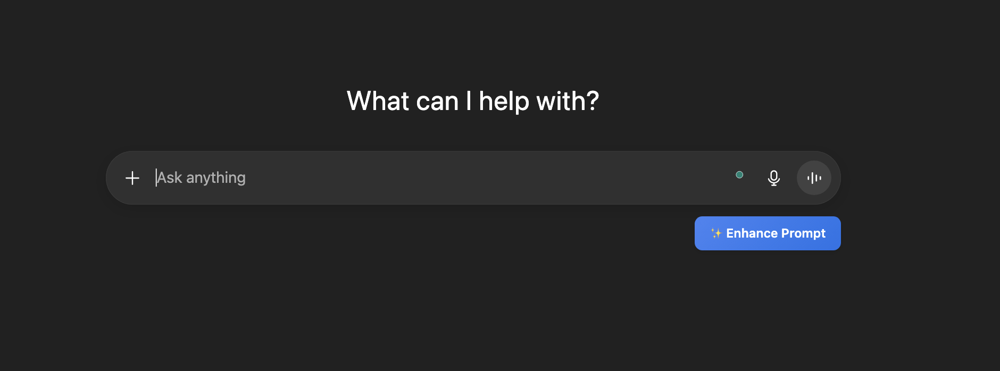

# Prompt Enhancer Chrome Extension ✨

Prompt Enhancer is a Chrome extension that supercharges your prompts on popular AI chat platforms like **ChatGPT**, **Google Gemini**, and **Perplexity AI**. With a single click, your prompt is rewritten to be clearer, more specific, and more effective—using the power of the **Google Gemini API** (with a free API key).

<p align="center">
  
</p>

---

## 🚀 Features

- **Enhance Prompts Instantly:** Adds an "Enhance Prompt" button to AI chat input boxes.
- **Site-Aware:** Works seamlessly on ChatGPT, Gemini, and Perplexity AI.
- **Smart Placement:** Uses MutationObserver for robust button injection, even on dynamic UIs.
- **Secure:** Your Gemini API key is stored securely in Chrome's extension storage.
- **Easy Setup:** Simple options page to save your API key.

---

## 🛠 Installation

1. **Clone or Download the Repository**
   ```sh
   git clone https://github.com/yourusername/prompt-enhancer.git
   ```
   Or download as ZIP and extract.

2. **Open Chrome Extensions Page**
   - Go to `chrome://extensions`
   - Enable **Developer mode** (toggle in the top right)

3. **Load the Extension**
   - Click **Load unpacked**
   - Select the folder where you cloned/extracted this repository

4. **Set Up Your Gemini API Key**
   - Click the Prompt Enhancer icon in your Chrome toolbar, or click "Details" > "Extension options"
   - Paste your [Google Gemini API key](https://makersuite.google.com/app/apikey) and save

---

## 💡 How It Works

- On supported AI chat sites, you'll see a ✨ **Enhance Prompt** button below the input box.
- Write your prompt, click the button, and your prompt will be rewritten for clarity and effectiveness using Gemini.
- The enhanced prompt replaces your original input—ready to send!

---

## 🖼️ Example

<p align="center">
  
</p>

---

## 🔑 Getting a Gemini API Key

1. Visit [Google AI Studio](https://makersuite.google.com/app/apikey)
2. Sign in with your Google account
3. Click **Create API Key**
4. Copy the key and paste it into the extension's options page

---

## 📝 Supported Sites

- [ChatGPT](https://chat.openai.com/)
- [Google Gemini](https://gemini.google.com/)
- [Perplexity AI](https://perplexity.ai/)

---

## 📦 Project Structure

- `content.js` — Content script for injecting the button and handling prompt enhancement
- `options.html` / `options.js` — Options page for API key management
- `service_worker.js` — Background tasks and messaging
- `manifest.json` — Chrome extension manifest

---

## 🤝 Contributing

Pull requests and suggestions are welcome! Please open an issue to discuss your ideas.

---

## 📄 License

MIT License

---

> **Prompt Enhancer** — Make your AI prompts shine ✨
